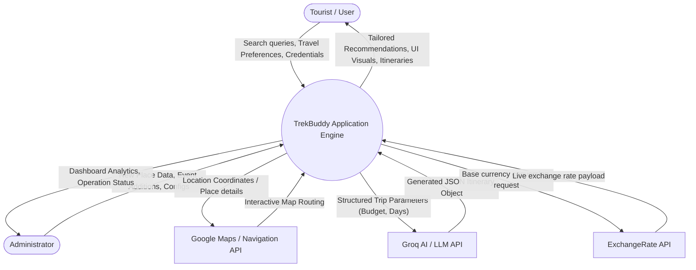
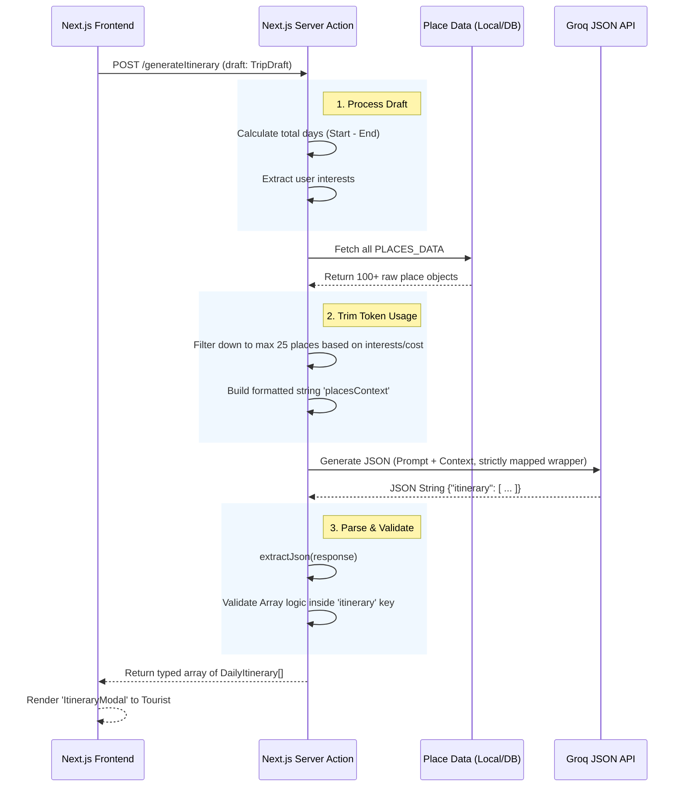

# TrekBuddy: Data Flow Diagrams (DFD)

This document outlines the data workflows for the TrekBuddy application. It includes the **Level 0 Context Diagram**, the **Level 1 Process Breakdown**, and a dedicated data flow for the **AI Itinerary Planner**.

---

## 1. Context Diagram (Level 0 DFD)
The Level 0 diagram shows the entire TrekBuddy system as a single process interacting with external entities (Users, Admins, and Third-Party APIs).



---

## 2. Main System Processes (Level 1 DFD)
The Level 1 diagram breaks the TrekBuddy system down into its 4 core sub-processes and shows how data moves between them and the core database.

```mermaid
flowchart LR
    %% Entities
    User([Tourist])
    ExtAPI[External APIs: Maps, AI, Forex]
    DB[("MongoDB Data Store\n(Users, Places, Events)")]

    %% Sub-Processes
    subgraph TrekBuddy System Processes
        P1((1.0 \n Authentication \n & Session))
        P2((2.0 \n Place Discovery \n & Search))
        P3((3.0 \n AI Trip Planner \n Module))
        P4((4.0 \n Utilities \n (Currency, Emergency)))
    end

    %% Flows for 1.0
    User -- "Login / Signup details" --> P1
    P1 -- "Validate / Insert" --> DB
    DB -- "User Profile" --> P1
    P1 -- "Auth Token (JWT/Session)" --> User

    %% Flows for 2.0
    User -- "Category Filters, Search Terms" --> P2
    P2 -- "Fetch Indexed Data" --> DB
    DB -- "List of matching places" --> P2
    P2 -- "Rendered Place Cards" --> User

    %% Flows for 3.0
    User -- "Trip Needs (Pace, Budget, Days)" --> P3
    P3 -- "Fetch relevant places" --> DB
    DB -- "Seed Data" --> P3
    P3 -- "Prompt Payload" --> ExtAPI
    ExtAPI -- "Validated JSON" --> P3
    P3 -- "Finalized Trip UI" --> User

    %% Flows for 4.0
    User -- "Currency Value (e.g., 50 EUR)" --> P4
    P4 -- "Fetch Base Rates" --> ExtAPI
    ExtAPI -- "Rate Payload" --> P4
    P4 -- "Calculated INR Value" --> User
```

---

## 3. Deep-Dive: AI Itinerary Generator Data Flow
As we recently optimized the Planner code, here is the exact step-by-step data mutation sequence for the **Groq AI trip generation feature**.


